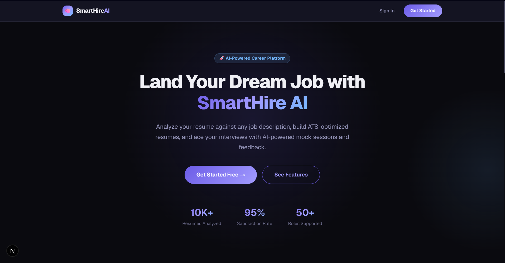
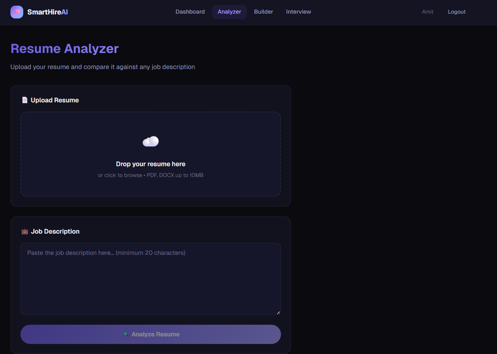
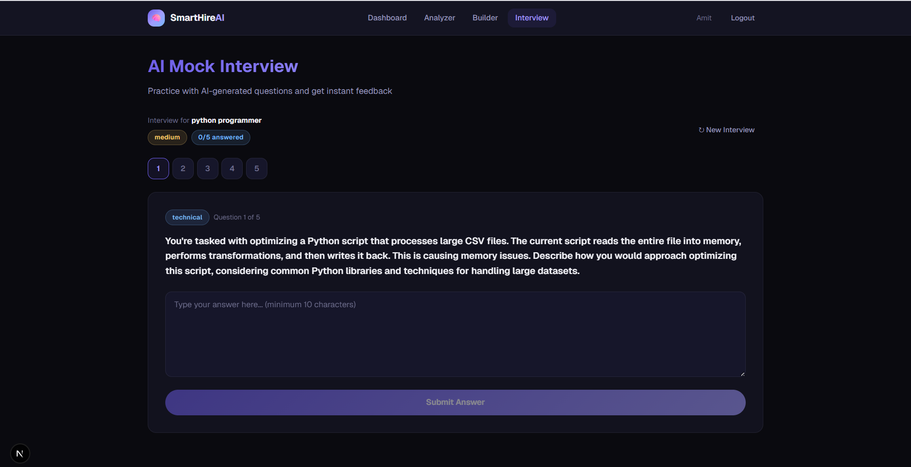
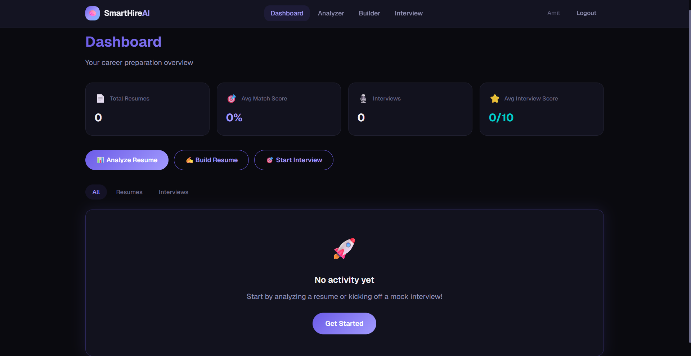
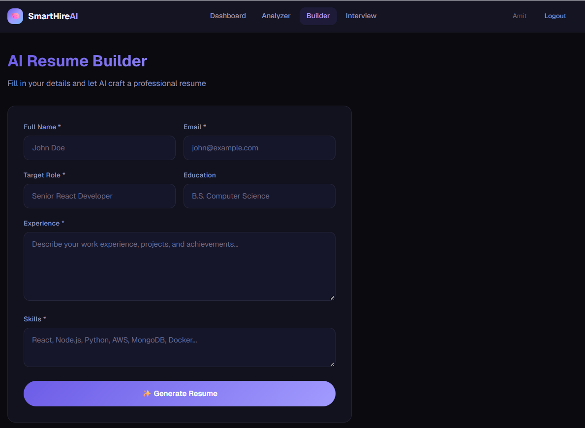
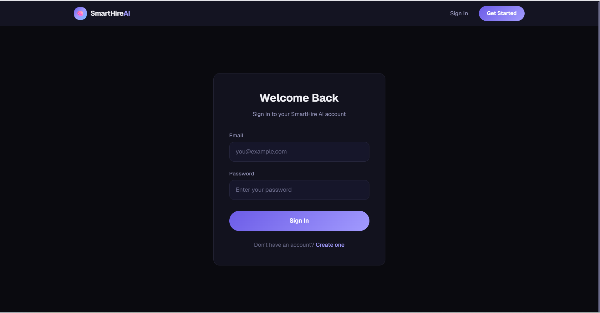

<div align="center">

# 🧠 SmartHire AI

### Resume & Interview Copilot

[](https://nextjs.org/)
[](https://expressjs.com/)
[](https://mongodb.com/)
[](https://tailwindcss.com/)
[](LICENSE)

**AI-powered career platform** that analyzes resumes, builds professional resumes, and conducts mock interviews with real-time AI feedback.

[Live Demo](#) · [Report Bug](../../issues) · [Request Feature](../../issues)

</div>

---

## 📸 Screenshots

| Landing Page | Resume Analyzer | Interview Session |
|:---:|:---:|:---:|
|  |  |  |

| Dashboard | Resume Builder | Login |
|:---:|:---:|:---:|
|  |  |  |

> Screenshots are placeholders. Replace with actual screenshots after deployment.

---

## ✨ Features

### 🔐 Authentication
- JWT-based login & signup
- Secure password hashing (bcrypt, 12 salt rounds)
- Protected routes with auto-redirect

### 📊 Resume Analyzer
- Upload PDF/DOCX resumes
- Extract text automatically
- AI-powered analysis against job descriptions
- **ATS Match Score** with animated gauge
- Missing skills identification
- Actionable improvement suggestions

### ✍️ AI Resume Builder
- Form-based input (name, experience, skills, target role)
- AI generates professional summary, experience bullets, and skills
- Download resume as text file
- Copy to clipboard

### 🎯 Mock Interview System
- Role & difficulty-based question generation
- Mix of technical, behavioral, and situational questions
- Per-question AI feedback with scoring
- Overall session score summary

### 📈 Dashboard
- Aggregate stats (total resumes, interviews, avg scores)
- Recent activity feed
- History filtering (all / resumes / interviews)
- Quick action buttons

---

## 🏗️ Architecture

```
┌─────────────────────────────────────────────────────┐
│                    Frontend (Next.js)                 │
│  ┌──────────┐  ┌──────────┐  ┌───────────────────┐  │
│  │ Landing   │  │ Auth     │  │ Protected Pages   │  │
│  │ Page      │  │ Pages    │  │ Dashboard / Tools │  │
│  └──────────┘  └──────────┘  └───────────────────┘  │
│         │             │               │              │
│         └─────────────┼───────────────┘              │
│                       │ Axios + JWT                  │
└───────────────────────┼──────────────────────────────┘
                        │ REST API
┌───────────────────────┼──────────────────────────────┐
│                    Backend (Express.js)               │
│  ┌────────────────────┼──────────────────────────┐   │
│  │              API Gateway                       │   │
│  │  Helmet │ CORS │ Rate Limiter │ Morgan/Winston│   │
│  └────────────────────┼──────────────────────────┘   │
│                       │                              │
│  ┌──────────┐  ┌──────────┐  ┌──────────────────┐   │
│  │ Routes   │→ │Controllers│→ │    Services      │   │
│  │ (auth,   │  │ (auth,   │  │ ┌──────────────┐ │   │
│  │  resume, │  │  resume, │  │ │  AI Service   │ │   │
│  │  interview│ │  interview│ │ │ (Gemini/OpenAI)│ │   │
│  │  dashboard│ │  dashboard│ │ └──────────────┘ │   │
│  └──────────┘  └──────────┘  └──────────────────┘   │
│                       │                              │
│  ┌──────────────────────────────────────────────┐   │
│  │              MongoDB (Mongoose)               │   │
│  │   Users  │   Resumes  │   Interviews          │   │
│  └──────────────────────────────────────────────┘   │
└──────────────────────────────────────────────────────┘
```

---

## 🛠️ Tech Stack

| Layer | Technology |
|-------|-----------|
| **Frontend** | Next.js 14 (App Router), Tailwind CSS, Axios, react-hot-toast |
| **Backend** | Node.js, Express.js, express-validator |
| **Database** | MongoDB + Mongoose |
| **Auth** | JWT (jsonwebtoken), bcryptjs |
| **AI** | Google Gemini / OpenAI (abstracted) |
| **Security** | Helmet, express-rate-limit, CORS, input sanitization |
| **Logging** | Winston (file + console) + Morgan (HTTP) |
| **File Parsing** | pdf-parse, mammoth |
| **Upload** | Multer |

---

## 📁 Project Structure

```
smarthire-ai/
├── client/                     # Next.js Frontend
│   ├── app/
│   │   ├── layout.js           # Root layout with providers
│   │   ├── page.js             # Landing page
│   │   ├── globals.css         # Design system + tokens
│   │   ├── login/page.js       # Login page
│   │   ├── register/page.js    # Registration page
│   │   ├── dashboard/page.js   # User dashboard
│   │   ├── resume-analyzer/    # Resume analysis tool
│   │   ├── resume-builder/     # AI resume generator
│   │   └── interview/          # Mock interview system
│   ├── components/
│   │   ├── Navbar.jsx          # Responsive navigation
│   │   ├── ClientLayout.jsx    # Auth + Toast providers
│   │   ├── ProtectedRoute.jsx  # Auth guard
│   │   ├── ScoreGauge.jsx      # Animated score ring
│   │   ├── FileUpload.jsx      # Drag & drop upload
│   │   └── LoadingSpinner.jsx  # Spinner + Skeletons
│   ├── context/
│   │   └── AuthContext.js      # Auth state management
│   └── lib/
│       └── api.js              # Axios instance
│
├── server/                     # Express Backend
│   ├── config/
│   │   ├── index.js            # Environment-based config
│   │   └── logger.js           # Winston logger setup
│   ├── controllers/
│   │   ├── authController.js
│   │   ├── resumeController.js
│   │   ├── interviewController.js
│   │   └── dashboardController.js
│   ├── middleware/
│   │   ├── auth.js             # JWT verification
│   │   ├── errorHandler.js     # Global error handler
│   │   └── validate.js         # Input validation
│   ├── models/
│   │   ├── User.js
│   │   ├── Resume.js
│   │   └── Interview.js
│   ├── routes/
│   │   ├── authRoutes.js
│   │   ├── resumeRoutes.js
│   │   ├── interviewRoutes.js
│   │   └── dashboardRoutes.js
│   ├── services/
│   │   ├── aiService.js        # AI abstraction (Gemini/OpenAI)
│   │   ├── resumeService.js    # File parsing + AI analysis
│   │   └── interviewService.js # Question gen + evaluation
│   ├── index.js                # Server entry point
│   └── .env.example            # Environment template
│
└── README.md
```

---

## 🚀 Quick Start

### Prerequisites

- Node.js 18+
- MongoDB (local or [Atlas](https://www.mongodb.com/atlas))
- AI API key ([Gemini](https://aistudio.google.com/apikey) or [OpenAI](https://platform.openai.com/api-keys))

### 1. Clone the Repository

```bash
git clone https://github.com/your-username/smarthire-ai.git
cd smarthire-ai
```

### 2. Backend Setup

```bash
cd server
cp .env.example .env
# Edit .env with your values (MongoDB URI, API keys, JWT secret)
npm install
npm run dev
```

### 3. Frontend Setup

```bash
cd client
cp .env.local.example .env.local
# Edit .env.local if needed
npm install
npm run dev
```

### 4. Open in Browser

Visit [http://localhost:3000](http://localhost:3000)

---

## ⚙️ Environment Variables

### Backend (`server/.env`)

| Variable | Description | Required |
|----------|-------------|----------|
| `NODE_ENV` | `development` or `production` | ✅ |
| `PORT` | Server port (default: 5000) | ❌ |
| `MONGODB_URI` | MongoDB connection string | ✅ |
| `JWT_SECRET` | Secret key for JWT signing | ✅ |
| `JWT_EXPIRES_IN` | Token expiry (default: `7d`) | ❌ |
| `AI_PROVIDER` | `gemini` or `openai` | ✅ |
| `GEMINI_API_KEY` | Google Gemini API key | If using Gemini |
| `OPENAI_API_KEY` | OpenAI API key | If using OpenAI |
| `CLIENT_URL` | Frontend URL for CORS | ✅ |

### Frontend (`client/.env.local`)

| Variable | Description | Required |
|----------|-------------|----------|
| `NEXT_PUBLIC_API_URL` | Backend API URL | ✅ |

---

## 🌐 API Endpoints

| Method | Endpoint | Auth | Description |
|--------|----------|------|-------------|
| `POST` | `/api/auth/register` | ❌ | Create account |
| `POST` | `/api/auth/login` | ❌ | Get JWT token |
| `POST` | `/api/resume/upload` | ✅ | Upload PDF/DOCX resume |
| `POST` | `/api/resume/analyze` | ✅ | Analyze resume vs job description |
| `POST` | `/api/resume/build` | ✅ | Generate resume sections |
| `GET`  | `/api/resume/:id` | ✅ | Get specific resume |
| `POST` | `/api/interview/start` | ✅ | Start interview session |
| `POST` | `/api/interview/feedback` | ✅ | Submit answer & get feedback |
| `GET`  | `/api/interview/:id` | ✅ | Get interview session |
| `GET`  | `/api/dashboard` | ✅ | Get dashboard data |
| `GET`  | `/api/health` | ❌ | Health check |

---

## 🚢 Deployment Guide

### Frontend → Vercel

1. Push code to GitHub
2. Go to [vercel.com](https://vercel.com) → New Project
3. Import your GitHub repo
4. Set **Root Directory**: `client`
5. Add environment variable:
   - `NEXT_PUBLIC_API_URL` = `https://your-backend.onrender.com/api`
6. Deploy!

### Backend → Render

1. Go to [render.com](https://render.com) → New Web Service
2. Connect GitHub repo
3. Settings:
   - **Root Directory**: `server`
   - **Build Command**: `npm install`
   - **Start Command**: `node index.js`
4. Add environment variables (all from `.env.example`)
5. Set `CLIENT_URL` to your Vercel URL
6. Deploy!

### MongoDB → Atlas

1. Go to [mongodb.com/atlas](https://www.mongodb.com/atlas)
2. Create a free M0 cluster
3. Create a database user
4. Whitelist `0.0.0.0/0` (for Render)
5. Get connection string → paste in `MONGODB_URI`

---

## 🔒 Security Features

- **Helmet** — Sets HTTP security headers
- **Rate Limiting** — 100 req/15min (general), 20 req/15min (auth)
- **Input Sanitization** — express-validator with escape/trim
- **Password Hashing** — bcrypt with 12 salt rounds
- **JWT Auth** — Signed tokens with configurable expiry
- **CORS** — Environment-configured origin whitelist
- **Error Handling** — No stack traces in production

---

## 📝 License

This project is licensed under the MIT License.

---

<div align="center">

Built with ❤️ by [Amit Kumar Singh](https://github.com/AmitNIET159)

</div>
